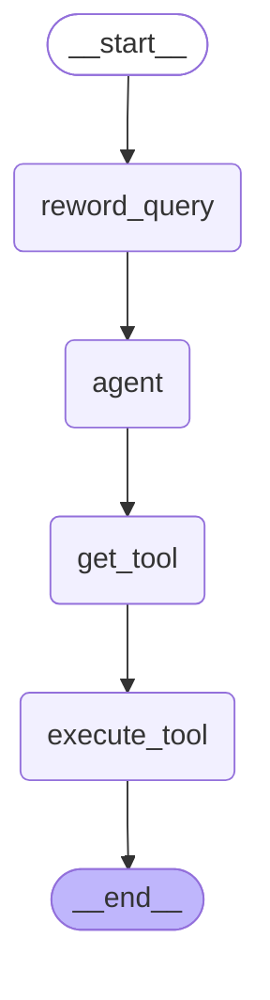

```mermaid
%%{init: {'flowchart': {'curve': 'linear'}}}%%
graph TD;
	__start__([__start__]):::first
	agent(agent)
	reword_query(reword_query)
	get_tool(get_tool)
	execute_tool(execute_tool)
	__end__([__end__]):::last
	__start__ --> reword_query;
	agent --> get_tool;
	execute_tool --> __end__;
	get_tool --> execute_tool;
	reword_query --> agent;
	classDef default fill:#f2f0ff,line-height:1.2
	classDef first fill-opacity:0
	classDef last fill:#bfb6fc

```
