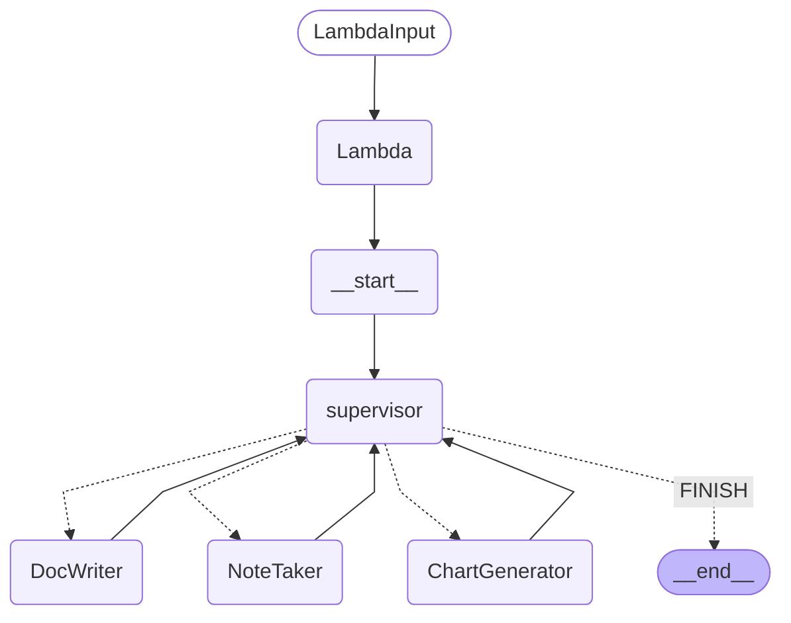

```mermaid
%%{init: {'flowchart': {'curve': 'linear'}}}%%
graph TD;
	LambdaInput([LambdaInput]):::first
	Lambda(Lambda)
	__start__(__start__)
	DocWriter(DocWriter)
	NoteTaker(NoteTaker)
	ChartGenerator(ChartGenerator)
	supervisor(supervisor)
	__end__([__end__]):::last
	LambdaInput --> Lambda;
	ChartGenerator --> supervisor;
	DocWriter --> supervisor;
	NoteTaker --> supervisor;
	__start__ --> supervisor;
	supervisor -.-> DocWriter;
	supervisor -.-> NoteTaker;
	supervisor -.-> ChartGenerator;
	supervisor -. &nbspFINISH&nbsp .-> __end__;
	Lambda --> __start__;
	classDef default fill:#f2f0ff,line-height:1.2
	classDef first fill-opacity:0
	classDef last fill:#bfb6fc

```
