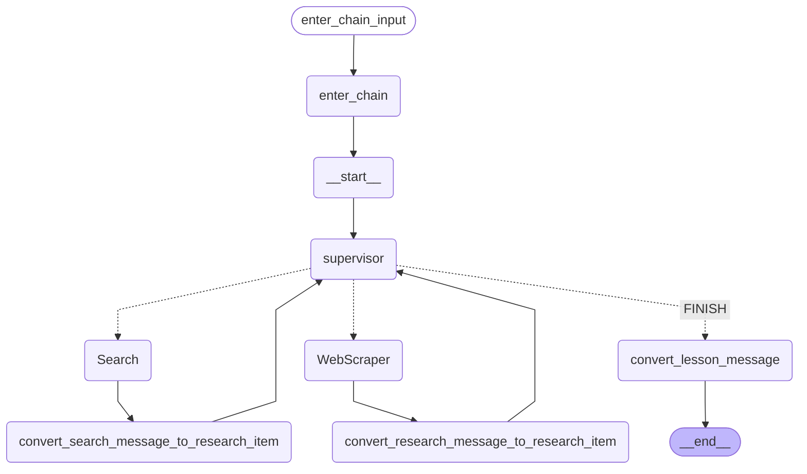

```mermaid
%%{init: {'flowchart': {'curve': 'linear'}}}%%
graph TD;
	enter_chain_input([enter_chain_input]):::first
	enter_chain(enter_chain)
	__start__(__start__)
	Search(Search)
	WebScraper(WebScraper)
	supervisor(supervisor)
	convert_search_message_to_research_item(convert_search_message_to_research_item)
	convert_research_message_to_research_item(convert_research_message_to_research_item)
	convert_lesson_message(convert_lesson_message)
	__end__([__end__]):::last
	enter_chain_input --> enter_chain;
	Search --> convert_search_message_to_research_item;
	WebScraper --> convert_research_message_to_research_item;
	__start__ --> supervisor;
	convert_lesson_message --> __end__;
	convert_research_message_to_research_item --> supervisor;
	convert_search_message_to_research_item --> supervisor;
	supervisor -.-> Search;
	supervisor -.-> WebScraper;
	supervisor -. &nbspFINISH&nbsp .-> convert_lesson_message;
	enter_chain --> __start__;
	classDef default fill:#f2f0ff,line-height:1.2
	classDef first fill-opacity:0
	classDef last fill:#bfb6fc

```
