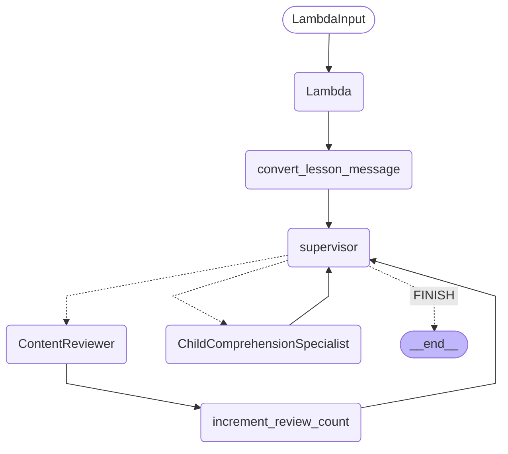

```mermaid
%%{init: {'flowchart': {'curve': 'linear'}}}%%
graph TD;
	LambdaInput([LambdaInput]):::first
	Lambda(Lambda)
	ContentReviewer(ContentReviewer)
	ChildComprehensionSpecialist(ChildComprehensionSpecialist)
	supervisor(supervisor)
	convert_lesson_message(convert_lesson_message)
	increment_review_count(increment_review_count)
	__end__([__end__]):::last
	LambdaInput --> Lambda;
	ChildComprehensionSpecialist --> supervisor;
	ContentReviewer --> increment_review_count;
	convert_lesson_message --> supervisor;
	increment_review_count --> supervisor;
	supervisor -.-> ContentReviewer;
	supervisor -.-> ChildComprehensionSpecialist;
	supervisor -. &nbspFINISH&nbsp .-> __end__;
	Lambda --> convert_lesson_message;
	classDef default fill:#f2f0ff,line-height:1.2
	classDef first fill-opacity:0
	classDef last fill:#bfb6fc

```
