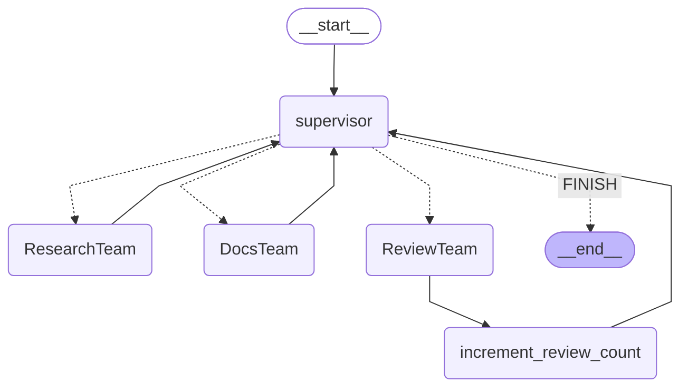

```mermaid
%%{init: {'flowchart': {'curve': 'linear'}}}%%
graph TD;
	__start__([__start__]):::first
	ResearchTeam(ResearchTeam)
	DocsTeam(DocsTeam)
	ReviewTeam(ReviewTeam)
	supervisor(supervisor)
	increment_review_count(increment_review_count)
	__end__([__end__]):::last
	DocsTeam --> supervisor;
	ResearchTeam --> supervisor;
	ReviewTeam --> increment_review_count;
	__start__ --> supervisor;
	increment_review_count --> supervisor;
	supervisor -.-> DocsTeam;
	supervisor -.-> ResearchTeam;
	supervisor -.-> ReviewTeam;
	supervisor -. &nbspFINISH&nbsp .-> __end__;
	classDef default fill:#f2f0ff,line-height:1.2
	classDef first fill-opacity:0
	classDef last fill:#bfb6fc

```
