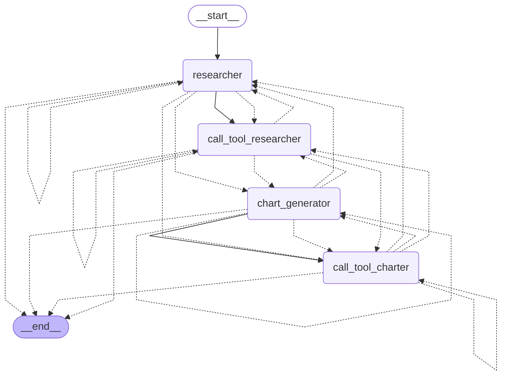

```mermaid
%%{init: {'flowchart': {'curve': 'linear'}}}%%
graph TD;
	__start__([__start__]):::first
	researcher(researcher)
	chart_generator(chart_generator)
	call_tool_charter(call_tool_charter)
	call_tool_researcher(call_tool_researcher)
	__end__([__end__]):::last
	__start__ --> researcher;
	chart_generator --> call_tool_charter;
	researcher --> call_tool_researcher;
	researcher -.-> researcher;
	researcher -.-> chart_generator;
	researcher -.-> call_tool_charter;
	researcher -.-> call_tool_researcher;
	researcher -.-> __end__;
	chart_generator -.-> researcher;
	chart_generator -.-> chart_generator;
	chart_generator -.-> call_tool_charter;
	chart_generator -.-> call_tool_researcher;
	chart_generator -.-> __end__;
	call_tool_charter -.-> researcher;
	call_tool_charter -.-> chart_generator;
	call_tool_charter -.-> call_tool_charter;
	call_tool_charter -.-> call_tool_researcher;
	call_tool_charter -.-> __end__;
	call_tool_researcher -.-> researcher;
	call_tool_researcher -.-> chart_generator;
	call_tool_researcher -.-> call_tool_charter;
	call_tool_researcher -.-> call_tool_researcher;
	call_tool_researcher -.-> __end__;
	classDef default fill:#f2f0ff,line-height:1.2
	classDef first fill-opacity:0
	classDef last fill:#bfb6fc

```
