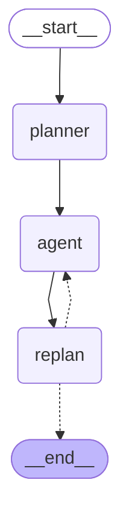

```mermaid
%%{init: {'flowchart': {'curve': 'linear'}}}%%
graph TD;
	__start__([__start__]):::first
	planner(planner)
	agent(agent)
	replan(replan)
	__end__([__end__]):::last
	__start__ --> planner;
	agent --> replan;
	planner --> agent;
	replan -.-> agent;
	replan -.-> __end__;
	classDef default fill:#f2f0ff,line-height:1.2
	classDef first fill-opacity:0
	classDef last fill:#bfb6fc

```
